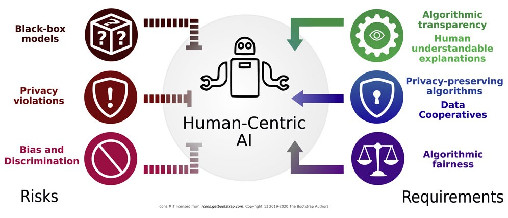

# Ethics

Machine learning models have the potential to significantly impact society and raise various ethical concerns. Here are some examples of ethical concerns related to machine learning models:

Image from: Lepri, Bruno, Nuria Oliver, and Alex Pentland. "Ethical machines: The human-centric use of artificial intelligence." IScience 24.3 (2021): 102249.

**Bias and Discrimination:** Machine learning models are only as good as the data they are trained on. If the data is biased or discriminatory, then the model will be biased or discriminatory as well. This can lead to unfair treatment or decisions, such as denying job applications or loans to certain groups of people based on their race, gender, or other demographic factors. For real-life examples of AI bias, read [this article](https://datatron.com/real-life-examples-of-discriminating-artificial-intelligence/).

**Privacy:** Machine learning models often require large amounts of data to be trained effectively, which can include personal information such as health records, financial data, or social media activity. This raises concerns about privacy and the potential for this information to be misused or shared without consent.

**Transparency and Explainability:** Machine learning models can be difficult to understand and interpret, which makes it challenging to identify biases or errors in the model. It is crucial for machine learning models to be transparent and explainable, especially in high-stakes decision-making processes such as healthcare, criminal justice, or finance.

**Accountability:** Machine learning models are created by humans, and errors or biases in the model are ultimately the responsibility of the people who created them. However, it can be challenging to hold individuals or organizations accountable for the actions of machine learning models, especially when the impact of the model is not immediately apparent.

**Unintended Consequences:** Machine learning models can have unintended consequences, such as automating decisions that should be made by humans or reinforcing existing biases in society. It is important to consider the potential unintended consequences of machine learning models before deploying them in real-world settings.

Some examples of machine learning applications that raise ethical concerns:

**Facial Recognition:** Facial recognition technology is often used for security and law enforcement purposes, but it has raised concerns about privacy and potential biases. Some facial recognition algorithms have been shown to be less accurate for certain groups of people, particularly those with darker skin tones. This can lead to misidentification and false arrests, as well as the potential for the technology to be used for discriminatory purposes.

**Credit Scoring:** Machine learning algorithms are often used to determine credit scores, which can impact a person's ability to obtain loans, credit cards, or other financial services. However, these algorithms can be biased, particularly against minority groups. For example, a study found that some credit scoring models penalized borrowers from predominantly black neighborhoods, even when they had similar credit profiles to borrowers from predominantly white neighborhoods.

**Predictive Policing:** Machine learning algorithms are increasingly being used for predictive policing, which involves using data to anticipate where crimes are likely to occur. However, there are concerns about the potential for these algorithms to reinforce existing biases in the criminal justice system. For example, if the algorithm is trained on data that reflects biased policing practices, it may recommend increased policing in certain neighborhoods or against certain groups of people.

**Healthcare:** Machine learning algorithms are being used to develop predictive models for healthcare, such as predicting patient outcomes or identifying patients who are at risk for certain conditions. However, there are concerns about the potential for these algorithms to perpetuate health disparities and biases. For example, if the algorithm is trained on data that reflects disparities in access to healthcare, it may recommend different treatment or care for certain groups of patients.

**Autonomous Vehicles:** Machine learning algorithms are being used to develop autonomous vehicles, which have the potential to reduce traffic accidents and save lives. However, there are concerns about the ethical implications of autonomous vehicles, particularly in cases where the vehicle must make a decision that could result in harm to passengers, pedestrians, or other drivers. For example, if an autonomous vehicle must decide between hitting a pedestrian or swerving and potentially harming the passengers, what ethical framework should be used to make that decision?

## AI Carbon Footprint

The training of AI models often requires substantial computational power and large datasets, which in turn require significant energy consumption. The deployment and operation of AI systems also contribute to their carbon footprint. AI applications that run on cloud infrastructure or data centers require ongoing power to operate, resulting in ongoing energy consumption and carbon emissions. The computations required for deep learning research have been increased by [300,000 folds](https://arxiv.org/abs/1907.10597) from 2012 to 2018. Additionally, the manufacturing and disposal of hardware components, such as AI-specific chips or servers, also contribute to the carbon footprint. [A study](https://hai.stanford.edu/news/ais-carbon-footprint-problem) found that training an off-the-shelf AI language-processing system produced around 600 Kg of emissions, about the amount produced by flying one person roundtrip between New York and San Francisco. 

Efforts are being made to reduce the AI carbon footprint and improve its sustainability. These efforts include developing more energy-efficient algorithms and optimizing computing infrastructure to minimize energy consumption during training and operation. [CodeCarbon](https://codecarbon.io) is a software package that can be integrated into a Python codebase and estimates the amount of CO2 produced by the cloud or personal computing resources used to execute the code. Furthermore, using renewable energy sources to power data centers and adopting energy-efficient hardware designs can also help reduce the environmental impact of AI. 