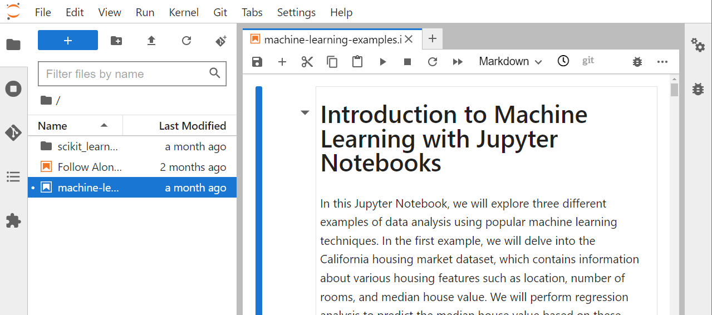

## Jupyter Notebooks

[Jupyter notebooks](https://jupyter.org/) are web-based interactive computing environments that allows you to create and share documents containing live code, equations, visualizations, and narrative text. They are commonly used for data exploration, prototyping, and visualization. Here are some reasons why you might want to use Jupyter notebooks:

* **Interactive Computing:** Jupyter notebooks provide an interactive computing environment where you can execute code and see the results immediately. This makes it easy to explore data and experiment with different techniques and algorithms.

* **Data Visualization:** Jupyter notebooks allow you to create rich data visualizations, including plots, charts, and maps. This makes it easy to explore and communicate your data to others.

* **Collaboration:** Jupyter notebooks can be easily shared and collaboratively edited by multiple people, making it easy to work together on a project or analysis.

* **Reproducibility:** Jupyter notebooks allow you to document your code and analysis in a single document, making it easy to reproduce your results and share them with others.

* **Flexible:** Jupyter notebooks support many programming languages, including Python, R, Julia, and more, making it easy to use the language of your choice.

Jupyter notebooks are particularly useful for exploratory data analysis, data visualization, and prototyping machine learning models. They allow you to work interactively with data and code, making it easy to iterate quickly and experiment with different techniques and algorithms.

Whether you chose to use Google Colab or UBC Syzygy, you can import the notebook prepared for this workshop using one of the following methods. Open the [repository](https://github.com/ubc-library-rc/intro-machine-learning/) for this workshop and download it as a zip file after clicking on the green `<> Code` button. All the examples are included a single file `machine-learning-examples.ipynb`. 

### Method 1: Direct Import

This method only works in Google Colab right now.

1. Open your preferred platform (Google Colab or UBC Syzygy) in your web browser.
2. Click on `File` in the top menu. Then click on `Upload Notebook` in Google Colab or `Open from Path` in Syzygy.
3. Select the workshop notebook file from your local machine. The file should have a `.ipynb` extension.
5. Wait for the platform to upload and import the notebook.
6. Once the import is complete, you can start working with the workshop notebook.

### Method 2: GitHub Import

This method only works in Google Colab right now.

1. Open Google Colab in your web browser.
2. Click on `File` in the top menu. Then click on `Open Notebook`.
3. Open the GitHub tab and enter the URL of the `.ipynb` file. For the current workshop, use: https://github.com/ubc-library-rc/intro-machine-learning/blob/main/machine-learning-examples.ipynb
4. Follow the prompts to import the notebook from GitHub. The platform will fetch the notebook and make it available for you to use.

## Running cells

Each notebook is divided into cells, which can contain code, text, or visualizations. To add a new cell, click on the "+" button in the toolbar or use the keyboard shortcut `B` for a new cell below or A for a new cell above. You can change the cell type to "Code" or "Markdown" using the dropdown menu in the toolbar. Code cells are used for writing and executing code, while Markdown cells are used for text and documentation.

In a code cell, you can write and execute code by typing it directly into the cell. To run a code cell, press `Shift + Enter` or click the "Run" button in the toolbar. The output of the code will be displayed below the cell.

Markdown cells allow you to write formatted text, add headers, create lists, include images, and more. To format text in a Markdown cell, use Markdown syntax. Refer to the Markdown documentation for various formatting options.

For the current workshop, run each cell by clicking the "Run" button, arrowhead symbol. The cell is fully executed when a number appears on the left side ribbon.

 

We use the following Python libraries in this workshop. These libraries provide powerful tools and functions to simplify and enhance our programming tasks.

1. [Numpy](https://numpy.org): Numpy is a fundamental library for numerical computing in Python. It provides support for efficient multidimensional array operations, mathematical functions, linear algebra routines, random number generation, and more. Numpy's array object is vital for working with large datasets and performing computations efficiently.

2. [Pandas](https://pandas.pydata.org): Pandas is a versatile library that offers data manipulation and analysis tools. It introduces two primary data structures, namely Series and DataFrame, which are powerful for handling structured data. Pandas enables data loading, cleaning, filtering, transforming, merging, and aggregation tasks, making it a go-to library for data wrangling.

3. [Matplotlib](https://matplotlib.org): Matplotlib is a popular visualization library that enables the creation of a wide range of static, animated, and interactive plots. It provides a comprehensive set of functions for generating line plots, scatter plots, bar plots, histograms, heatmaps, and more. Matplotlib allows customization of plot aesthetics and labeling, making it suitable for data exploration and presentation.

4. [Scikit-learn](https://scikit-learn.org/stable): Scikit-learn is a robust library for machine learning tasks. It offers a unified interface for implementing various machine learning algorithms, including classification, regression, clustering, dimensionality reduction, and model selection. Scikit-learn also provides utilities for data preprocessing, model evaluation, and model deployment, making it an essential tool for machine learning practitioners.
